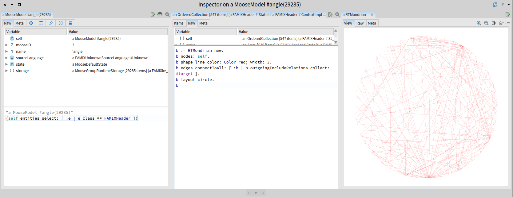

# Tools for analysis and visualization of C++ code

These are some interim tools designed to translate output from C++
analysers into a format possible to use with visualisation tools such
as [Moose](http://www.moosetechnology.org/).

They remain somewhat unpolished and still contain things specific to
the project this was developed to analyse
([Siconos](http://siconos.gforge.inria.fr/)), stay tuned for some
instructions and examples.

## SrcML to MSE converter

Find some entities in SrcML output for C++ (classes, functions,
variable, etc.) and outputs them in MSE format.

Usage:

~~~
./srcml-to-mse.py <filename.xml.bz2>
~~~

where `filename.xml.bz2` is the output of running
[SrcML](http://www.srcml.org/) on a C++ tarball.  (I use `bz2` to the
output after running SrcML, but you don't have to.)

### About the MSE output

The MSE output is a format that can be used to make visualisations
using Moose.  The script contains a small set of classes for
generating this representation.  In its current form it's not very
reusable, however this may be better modularised in the future.

The first element in the MSE output is called the "Package".  You can
specify the package name using the command-line option "--package":

~~~
$ ./srcml-to-mse.py <filename.xml.bz2> --package <package name>
~~~

To get a feel for the format, try comparing the included example SrcML output to the generated MSE:

~~~
$ ./srcml-to-mse.py example.xml
$ cat example.mse
~~~

### Dependencies

Requires Python 3 and `lxml` to be installed.  Or, if you are using a
default Mac install and don't want to install a custom Python, the
following should work:

~~~
$ easy_install --upgrade --user .
~~~

This should read `setup.py` and install the `lxml` and `future`
packages for you.  You should then run the script, specifying Python
manually:

~~~
$ python srcml-to-mse.py <filename.xml.bz2>
~~~

Note, the use of bzip2 to make the SrcML output a bit smaller is
optional.  If used, the MSE output will also be compressed.

# Installing on OSX

## Installing srcML
You also need to install srcML. Simply go to http://www.srcml.org/downloads.html and download a distribution. Unzipping the archive reveals a binary, it should be accessible within your PATH. The binary requires some library that should also be accessible within a global variable. You can insert in your .bash_profile file the following commands:
~~~
export PATH=$PATH:/FULLPATHTOSRCML/srcML/bin 
export DYLD_LIBRARY_PATH=/FULLPATHTOSRCML/srcML/lib
~~~

Naturally, you should replace FULLPATHTOSRCML by the full path pointing to the distribution of srcML.

##Installing lxml and future Python modules
As a second steps, you need to install the necessary libraries used by our srcml-to-mse scripts. The following instructions have to be executed within a terminal. 
~~~
sudo xcode-select --install
env STATIC_DEPS=true LIBXML2_VERSION=2.9.2 easy_install --user lxml
env STATIC_DEPS=true LIBXML2_VERSION=2.9.2 easy_install --user future
~~~

##Trying it
Go to a folder containing C / C++ code. The following examples uses the C++ Angle application (https://github.com/google/angle).

The following listing shows the generation of the Angle .mse file
~~~
~/CPPAnalysis> git clone https://github.com/google/angle
Cloning into 'angle'...
remote: Counting objects: 65233, done.
remote: Compressing objects: 100% (65/65), done.
remote: Total 65233 (delta 27), reused 0 (delta 0), pack-reused 65167
Receiving objects: 100% (65233/65233), 28.31 MiB | 486.00 KiB/s, done.
Resolving deltas: 100% (54798/54798), done.
Checking connectivity... done.
~/CPPAnalysis> cd angle/
~/CPPAnalysis/angle> srcml . > angle.xml
~/CPPAnalysis/angle> python /Users/alexandrebergel/Dropbox/Data/tools/cxxviz/srcml-to-mse.py angle.xml 
Loading angle.xml ...
Found 1074 units
Found 545 headers
Resolved 455 includes
Could not resolved 3710 includes (probably external libs)
Found 302 classes
Found 2983 non-class functions
Resolved 7 types
Found 18317 invocations
~/CPPAnalysis/angle> ls *.mse
angle.mse
~/CPPAnalysis/angle> 
~~~

That angle.mse can be loaded in the Moose software analysis platform (http://moosetechnology.org):

# Author

Stephen Sinclair <stephen.sinclair@inria.cl>

# Copyright

Apache 2.0.  See COPYING.md for more information.
